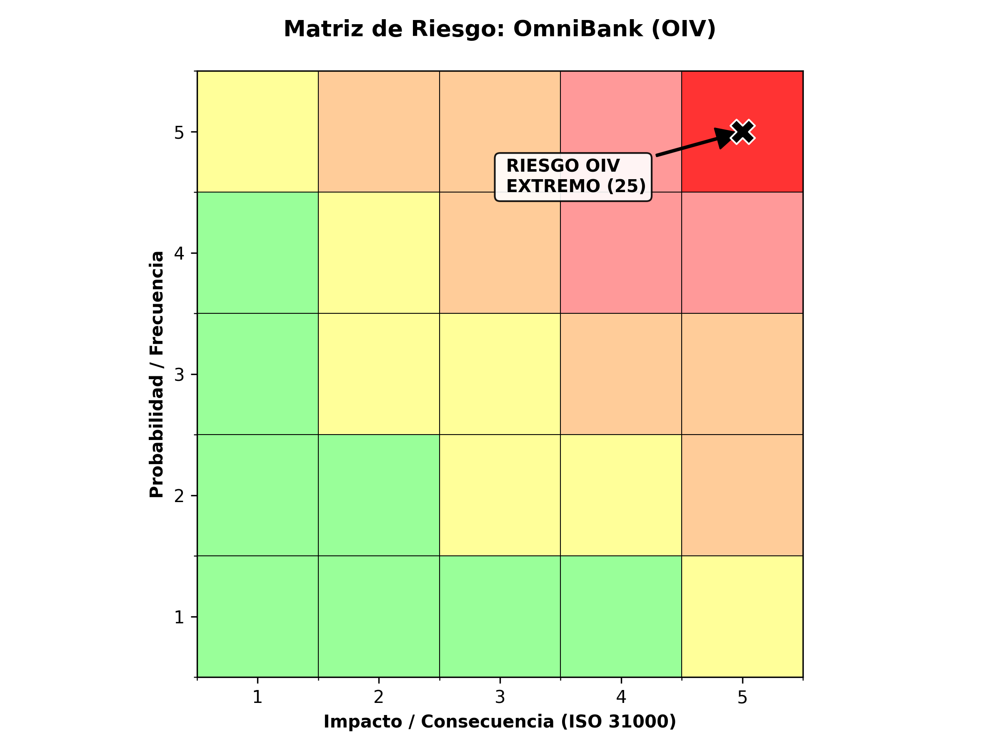

#  Expediente 02: OmniBank - Sector Financiero

##  Fase 2: Evaluación de Riesgos bajo Norma ISO 31000:2018

### 1. Marco de Gestión de Riesgos (ISO 31000)

Para este expediente, la gestión de riesgos no se limita al cumplimiento legal, sino que se integra en el corazón de la gobernanza de OmniBank. Como **Operador de Importancia Vital (OIV)**, el apetito de riesgo es casi nulo, dada la responsabilidad sobre la estabilidad financiera y la infraestructura crítica nacional (Ley 21.663).

### 2. Identificación de Riesgos (Contexto OIV y Ley 21.719)

Hemos identificado los eventos de riesgo que pueden impedir que OmniBank cumpla con sus objetivos de seguridad y privacidad:

| ID | Riesgo Identificado | Factor de Riesgo (Causa) | Activo Afectado |
| :--- | :--- | :--- | :--- |
| **R.01** | Vulneración de Reserva Bancaria | Interconexión lógica sin segmentación con Retail. | `omnibank_clientes.csv` |
| **R.02** | Sanción Gravísima APDP | Tratamiento de datos sin base de licitud válida. | Patrimonio (20.000 UTM). |
| **R.03** | Interrupción de Servicio | Movimiento lateral de amenaza desde el Holding. | Disponibilidad OIV. |

### 3. Análisis y Evaluación de Riesgos (Matriz 5x5)

Bajo los criterios de la ISO 31000, evaluamos el **Riesgo Inherente** (antes de controles):

* **Probabilidad (P):** 5 (Casi Seguro) - La interconexión técnica es un puente permanente.
* **Impacto (I):** 5 (Catastrófico) - La calificación de OIV implica riesgo de seguridad nacional.

**Nivel de Riesgo Inherente: 25 (Extremo - Crítico)**

### 4. Estrategia de Tratamiento de Riesgos

Siguiendo la ISO 31000, la dirección debe optar por **Mitigar** o **Evitar**.

1. **Mitigación Técnica:** Implementación de Aislamiento Lógico (Air Gapping).
2. **Mitigación Jurídica:** Cláusulas de Secreto Bancario Reforzado.
3. **Monitoreo:** Reporte inmediato a la ANCI (Ley 21.663).

### 5. Conclusión de la Fase 2

El análisis bajo ISO 31000 confirma que la estructura actual es incompatible con la seguridad exigida a un Operador de Importancia Vital.
