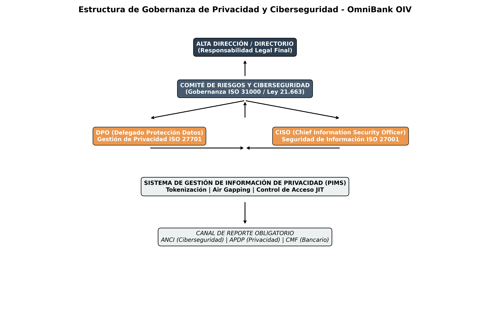

# Expediente 02: OmniBank - Sector Financiero
## Fase 3: Tratamiento y Gobernanza de Riesgos (ISO 27001 / 27701 / 31000)

### 1. Objetivos Estratégicos de Cumplimiento

Para mitigar el Riesgo Inherente Extremo (25) identificado en la fase anterior y alcanzar un nivel de riesgo residual aceptable, se establecen los siguientes objetivos de control basados en estándares internacionales:

* **Objetivo 1. Resiliencia de la Infraestructura Crítica (Ley 21.663):** Garantizar la continuidad operativa de OmniBank en su calidad de Operador de Importancia Vital (OIV). Se busca prevenir que incidentes de ciberseguridad en filiales con menores estándares de cumplimiento (Retail) afecten la disponibilidad del servicio financiero nacional.
* **Objetivo 2. Gestión de Privacidad según ISO 27701 (SGPI):** Implementar un Sistema de Gestión de Información de Privacidad que establezca roles claros como Responsable del Tratamiento (Controller) y Encargado del Tratamiento (Processor) dentro del Holding, asegurando que los datos personales financieros reciban un tratamiento diferenciado y protegido.
* **Objetivo 3. Salvaguarda del Secreto Bancario (Art. 154 LGB):** Asegurar la confidencialidad absoluta de los datos de solvencia, saldos y comportamiento transaccional. El acceso a estos activos quedará restringido exclusivamente al personal bancario bajo protocolos de auditoría estricta.
* **Objetivo 4. Aislamiento de Finalidad y Privacy by Design:** Establecer barreras técnicas (Data Siloing) para impedir que el perfilamiento crediticio sea utilizado por el segmento de Retail para fines comerciales no autorizados, garantizando el cumplimiento del principio de finalidad de la Ley 21.719.

### 2. Plan de Tratamiento del Riesgo (Matriz de Controles)

A continuación, se detallan las medidas de tratamiento aplicadas para mitigar los riesgos identificados (R.01, R.02 y R.03), integrando controles específicos de ISO 27701:

| ID Riesgo | Control de Mitigación (Tratamiento) | Estándar de Referencia | Objetivo Asociado |
| :--- | :--- | :--- | :--- |
| **R.01** | **Tokenización y Seudonimización:** Sustitución de identificadores reales por tokens en entornos compartidos para minimizar el riesgo de re-identificación. | ISO 27701 (Cláusula 6.12) | O.2 / O.4 |
| **R.02** | **Segmentación Lógica (Air Gapping):** Aislamiento del Core Bancario mediante firewalls de capa 7 para prevenir movimientos laterales desde el Holding. | ISO 27001 (Control A.13) | O.1 |
| **R.03** | **Control de Acceso Basado en Roles (RBAC):** Privilegios mínimos necesarios y revisión periódica de derechos de acceso a datos financieros. | ISO 27001 (Control A.9) | O.2 / O.3 |

### 3. Estructura de Gobernanza SGPI y OIV

Como Operador de Importancia Vital y Responsable de Tratamiento de datos sensibles, OmniBank adopta el siguiente modelo de gobernanza:

1. **Gobernanza de Datos Personales (SGPI):** Establecimiento de políticas de retención y eliminación de datos bancarios para asegurar que la información no permanezca en los sistemas del Holding más allá de lo legalmente permitido.
2. **Delegado de Protección de Datos (DPO):** Autoridad encargada de realizar Evaluaciones de Impacto en la Protección de Datos (DPIA) específicas bajo ISO 27701 antes de cualquier transferencia inter-filial.
3. **Protocolo de Notificación de Brechas:** Integración del requisito de notificación de la Ley 21.663 con los estándares de reporte de incidentes de privacidad, estableciendo un plazo máximo de 180 minutos para informar a la ANCI y la CMF en caso de afectación a la infraestructura crítica o datos sensibles.

### 3.1 Diagrama de Estructura de Gobernanza PIMS/OIV

A continuación se presenta la jerarquía de control establecida para garantizar la independencia del DPO y la coordinación con el CISO, asegurando la resiliencia operativa y el cumplimiento de las normativas ISO 27001 e ISO 27701.

### 4. Anexo de Responsabilidad Jurídica Reforzada

Se implementará un protocolo de responsabilidad legal obligatorio para todo el personal técnico con acceso a activos críticos. Este anexo contractual vincula la seguridad de la información con las siguientes consecuencias legales:

* **Responsabilidad Administrativa:** Despido justificado por infracción grave a las obligaciones de confidencialidad y privacidad.
* **Responsabilidad Penal:** Denuncia basada en el Artículo 284 del Código Penal respecto a la violación de secretos comerciales y bancarios.
* **Cumplimiento Normativo:** Responsabilidad civil por daños derivados de la infracción a la Ley 21.719 y las sanciones pecuniarias Agencia de Protección de Datos.

---
*Este documento constituye la hoja de ruta estratégica para la gestión del riesgo de privacidad y ciberseguridad en OmniBank.*